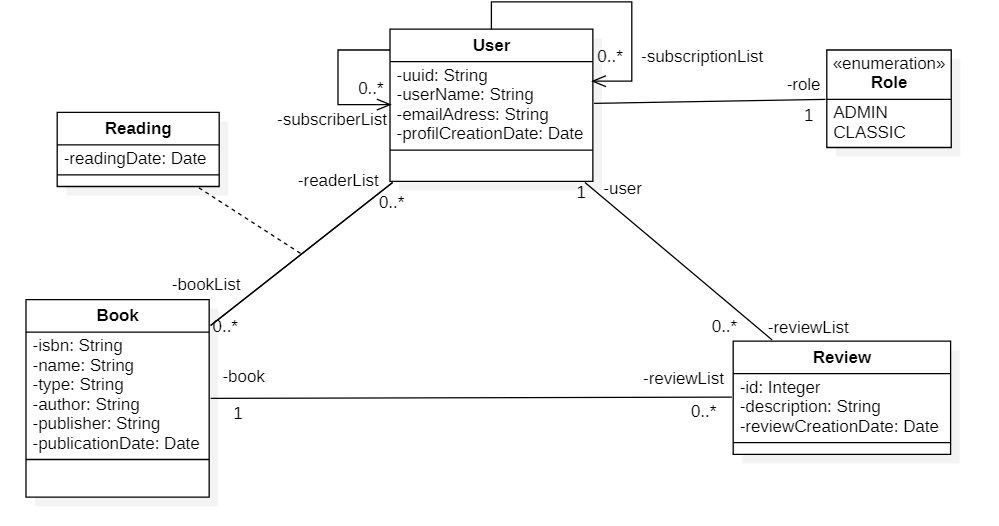

# LittleBook_Back
# 📘 Backend – Spring Boot 3 + Java 17 + SQL + Firebase

## 🚀 Stack technique
- [Java 17](https://www.oracle.com/java/technologies/javase/jdk17-archive-downloads.html) – LTS stable
- [Spring Boot 3.x](https://spring.io/projects/spring-boot) – framework backend
- [Lombok](https://projectlombok.org/) – simplification du code (getters, setters, constructeurs)
- [JUnit 5](https://junit.org/junit5/) – tests unitaires et d’intégration
- [SQL Database](https://www.mysql.com/) – base de données relationnelle (MySQL, PostgreSQL…)
- [Firebase](https://firebase.google.com/) – services cloud (authentification, notifications, storage…)
- [Open library](https://openlibrary.org/developers/api) - Récupération de l'ensemble des livres, genre, ...

---

## 📦 Installation

### 1. Cloner le projet
```bash
git clone https://github.com/MOUNIAT-1002/LittleBook_Back.git


---

## 🧩 Modèle de donnée

